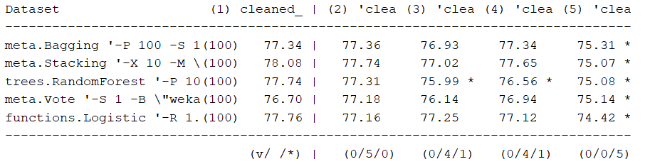
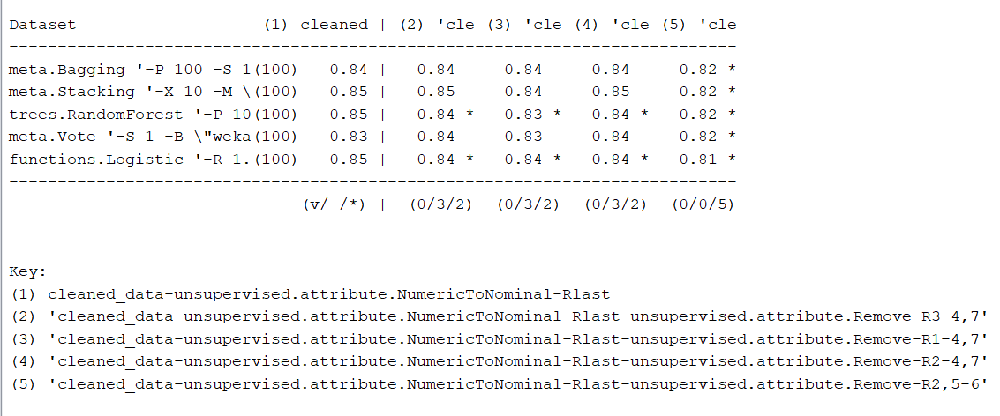
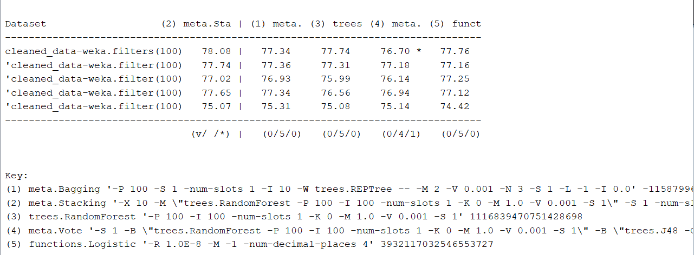
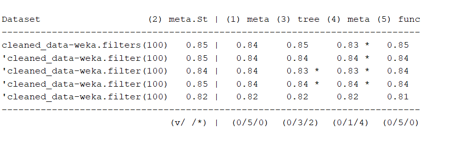
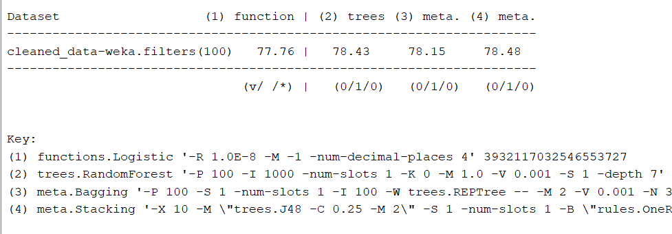
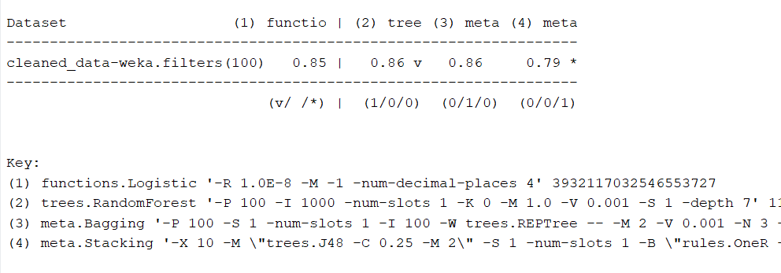

```{r setup, include=FALSE}
knitr::opts_chunk$set(echo = TRUE)
library(RWeka)
library(ggplot2)
```

When loading the data in Weka a filter (filters -> unsupervised -> NumericToNominal) needs to be applied to the age atribute to make sure the age atribute is nominal instead of numeric. Saving as an arff file prevents us to have to repeat this action every time. The most common algorithms will be run with 10 fold cross validation  and be added to a table to see their individual performances without changed parameters. 

```{r}
algorithm_scores <- data.frame(algorithm = c("ZeroR", "OneR"),
                               Percentage_Correct = c(64.9781, 73.9779),
                               Percentage_Wrong = c(35.0219, 26.0221)
                               )
naive_bayes <- c("Naive Bayes", 68.1409, 31.8591)
algorithm_scores <- rbind(algorithm_scores, naive_bayes)
j48 <- c("j48", 75.495, 24.505)
algorithm_scores <- rbind(algorithm_scores, j48)
IBk <- c("IBk", 70.5837, 29.4163)
algorithm_scores <- rbind(algorithm_scores, IBk)
logistic <- c("Logistic", 77.7064, 22.2936)
algorithm_scores <- rbind(algorithm_scores, logistic)
suport_vector_machine <- c("SMO", 76.4464, 23.5536)
algorithm_scores <- rbind(algorithm_scores, suport_vector_machine)
qda <- c("QDA (sex atribute removed)", 75.7521, 24.2479)
algorithm_scores <- rbind(algorithm_scores, qda)
bagging <- c("Bagging", 77.7578, 22.2422)
algorithm_scores <- rbind(algorithm_scores, bagging)
voting <- c("Vote", 64.9781, 35.0219)
algorithm_scores <- rbind(algorithm_scores, voting)
adaboost <- c("AdaBoostM1", 72.1265, 27.8735)
algorithm_scores <- rbind(algorithm_scores, adaboost)
stacking <- c("Stacking", 64.9781, 35.0219)
algorithm_scores <- rbind(algorithm_scores, stacking)
random_forest <- c("Random Forest", 77.9121, 22.0879)
algorithm_scores <- rbind(algorithm_scores, random_forest)
clustering_class <- c("ClassificationViaClustering", 62.4839, 37.5161)
algorithm_scores <- rbind(algorithm_scores, clustering_class)
knitr::kable(algorithm_scores[order(algorithm_scores$Percentage_Correct, decreasing = TRUE),], row.names = F)
```

The table above is sorted on the best scoring algorithms without any parameters changed except for the QDA where the gender of the crabs was removed. All the tests were done with 10 fold cross validation. 3 algorithms scored even lower then or equal to zeroR which is interesting considering that it just takes the most prominent value. When further investigating the exact 2 scores same scores of voting and stacking to ZeroR the conclusion fell that we needed to specify the algorithms there. So these 2 were rerun with 11 algorithms, all of the above except for voting and stacking self and QDA was also not included due to the fact that we want to use the sex attribute. 

```{r}
rerun <- data.frame(algorithm = c("Voting", 
                                  "Stacking with j48 meta", 
                                  "stacking with random forest meta"),
                    Percentage_Correct = c(76.6264, 76.4207, 78.272),
                    Percentage_Wrong = c(23.3736, 23.5793, 21.728))

knitr::kable(rerun)
```

The results gained from voting and stacking seems to be much better now. The meta classifier used for stacking was a j48 tree and after that a run with a random forest meta learner. The best scoring algorithms are: Stacking with a random forest, Random forest, bagging, logistic and voting. For now we will look further into these 5 algorithms and see if we can optimize the parameters to prevent over fitting and get better results. 

Before tweaking the algorithms let's see if the dataset can be tweaked for optimal performace. In weka in the select atributes tab the CfsSubsetEval with exhaustive search forward and backward and no different changes (2 different runs) both give Selected attributes: 1,3,4,7,8 
                     Sex,
                     Diameter,
                     Height,
                     Viscera.Weight,
                     Shell.Weight.
A gainratio select atributes with the ranker search method gives the following results: 
 0.0813   8 Shell.Weight
 0.0726   7 Viscera.Weight
 0.0721   3 Diameter
 0.0674   5 Weight
 0.066    2 Length
 0.0629   4 Height
 0.0579   6 Shucked.Weight
 0.0574   1 Sex
Lets see if these attributes are also selected for the individual algorithms when WrapperSubsetEval is run for each one with BestFirst and backwards as option within BestFirst. Since Random forest are build based on Random trees we will use the random tree here for a shorter calculation time. For the reason of time consumption voting and stacking were also not run through this. 

```{r}
selected_results <- data.frame(algorithm = c("Random Tree",
                                             "Logistic",
                                             "Bagging"),
                               selected_atributes = c("Sex, Length,
                               Weight, Shucked.Weight,
                               Shell.Weight", 
                               "Weight, Shucked.Weight, Shell.Weigh", 
                               "Sex, Weight, Shucked.Weight,
                               Shell.Weight"))
knitr::kable(selected_results, format = "simple")
```
4 sub sets are made, based on the 3 algorithms and the cfssubseteval. These are then tested in the explorer against each other.

The following are the results of a T test where the different datasets are tested with the percentage correct for the algorithms. This shows that the 4th smaller dataset scores significantly worse in all the algorithms and the 2nd and 3rd cleaned datasets when it comes to a random forest. 


The are under the curve shows us that the area under the curve is even significantly worse with all the smaller datasets for 2 different algorithms. The last smaller dataset is  worse for all algorithms. 


So lets focus on how the 5 algorithms scored compared to the whole dataset. Since stacking has the highest score this algorithm is used as the comparison. 





Vote scores significantly worse then stacking. When looking at the area under the curve stacking scores worse as well on the original dataset. 

So lets see if we can tweak the 4 algorithms without vote a bit more on the original dataset. 

Let's start with the random forest, since it is build on random trees we will try to improve an individual tree before 

```{r}
tree_scores <- data.frame(tree_depth = c("unlimited",
                                         "5",
                                         "6",
                                         "7",
                                         "8"),
                          percentage_corect = c(70.6351,
                                                74.1322,
                                                75.0064,
                                                75.6236,
                                                74.775))

knitr::kable(tree_scores, format = "simple")
```
The table shows the changes to the depth of the tree parameter and how they corresponded to the percentage correct with 10 fold cross validation. Now lets build a forest with trees with a depth of 7 since this seems to be the best parameter score wise. A forest with the depth of 7 gives a 78.5035 percent accuracy. By increasing the trees used under the iteration value to a 1000 instead of the standard 100 we get a 78.7349 percent accuracy. Increasing this to 10000 does take a lot more time and does not improve the score at all. 

By bagging we can change the number of iterations:

```{r}
bagging_itter <- data.frame(itterations = c("10",
                                            "100",
                                            "1000"),
                            percentage_correct = c(77.7578,
                                                   78.2206,
                                                   78.1435))

knitr::kable(bagging_itter, format = "simple")
```
Changing the number of iterations improves it when it is set to a 100 but decreases when set to a 1000. A 1000 iterations also takes more time and it is getting on the long side there with a time of 20.8 to build the model. SO bagging seems to be optimal at a 100 iterations for now. 

Stacking seems to improve when using less and simpler algorithms. Also with j48 as a meta learner. After some more experimenting with different algorithms and settings the highest percentage seems to be 79.0177 correct with an AUC of 0,817. The setting used are the following base algorithms: Random forest with depth of 7, logistic, IBk with 3 neighbours, bagging with 100 iterations and OneR. The meta learner used was J48 without any changes to the settings. Using less algorithms from different categories and improving their settings led to this. 

Since the 2 group in age is under represented a costsentive run was also tried where the matrix was changed to give 2 points to a 2 predicted as a 1 instead of a penalty of 1. This seemed to lower the overall score so no further experimentations were done on this area since a penalty of 2 was not much but lowered the score and did not change much in the actual group 2 predictions.

The only thing that makes sense to change with the logistic algorithm is the number of iterations, yet this does not improve the algorithm. A lower iteration maximum decreases the score and eventually you reach a threshold where the score is the same as not changing the maximum. 

An ROC curve is made of the 4 best algorithms with the changed variables.

```{r}
bagging_auc <- read.arff("Bagging_AUC.arff")
rf_auc <- read.arff("RF_AUC.arff")
logistic_auc <- read.arff("Logistic_AUC.arff")
stacking_auc <- read.arff("Stacking_AUC.arff")

subsetdata <- function(dataframe, value){
  subsetted <- subset(dataframe, select=c(`True Positives`, `False Positives`))
  subsetted$algorithm <- value
  return(subsetted)
}
all_auc <- rbind(subsetdata(bagging_auc, "bagging"),
              subsetdata(rf_auc, "Random Forest"),
              subsetdata(logistic_auc, "Logistic"),
              subsetdata(stacking_auc, "Stacking"))

ggplot(all_auc, aes(x=`False Positives`, y = `True Positives`, group = algorithm)) +
  geom_line(aes(color=algorithm)) +
  ggtitle("ROC curve of the different algorithms")

```
This shows that all the algorithms have almost the same curve except for stacking, that one is slightly worse then the rest. Let's see if this corresponds with what the Weka experimenter says. 





This shows that percentage correct is the highest with stacking, but only slightly higher then a random tree. But when looking at the AUC stacking is significantly worse. So for that reason the random forest with a tree depth of 7 is the chosen algorithm to continue with. Also cause of time consumption, the tree is faster then the stacking but also when looking at the categories like percentage correct and AUC a better choice. 